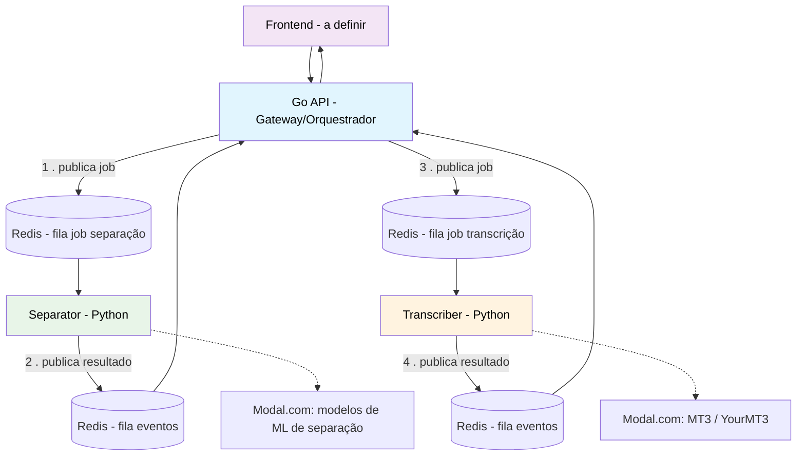

# Arquitetura do Sistema — Notefy

## Visão Geral

O Notefy é um sistema que recebe um áudio qualquer (música, gravação, som isolado) e gera notação musical tocável para um instrumento escolhido.

A arquitetura segue um modelo de microsserviços assíncronos, orquestrados por um gateway central e comunicados via fila de mensagens. O padrão adotado é **orquestração**: apenas o Go conhece a sequência do pipeline. Os workers Python não se comunicam entre si, nem sabem o que vem antes ou depois de sua própria etapa — cada um consome um job, processa, e publica seu resultado numa fila de eventos consumida pelo Go.



## Stack Tecnológica

| Camada | Tecnologia |
|---|---|
| Frontend | A definir (vue/react) |
| API Gateway / Orquestrador | Go |
| Serviço de Separação | Python |
| Serviço de Transcrição | Python |
| Fila de mensagens | Redis (RQ) |
| Inferência GPU (modelos de separação avançada, MT3/YourMT3) | Modal.com - validar |
| Modelos de separação | Demucs, BS-RoFormer/MDX-Net (via `audio-separator`) |
| Modelos de transcrição | Basic Pitch (free tier), MT3/YourMT3 (tier premium) |
| Containerização | Docker / Docker Compose |

## Princípios de Design

1. Um container = um worker = uma responsabilidade de domínio completa (consumo de fila e processamento na mesma unidade).
2. **Orquestração.** Somente o Go conhece a sequência do pipeline. Um serviço Python nunca publica diretamente na fila de outro serviço Python. Cada worker publica apenas seu próprio resultado numa fila de eventos, e é o Go quem decide o próximo passo.
3. Inferência GPU pesada é terceirizada via Modal.com.
4. Seleção de modelo (`tier`) é um parâmetro explícito recebido pelo worker, não uma decisão automática.

## Serviços

### 1. Go API (Gateway / Orquestrador)

Ponto único de entrada e única fonte de verdade sobre a sequência do pipeline. Responsabilidades:
- Autenticação e gestão de usuários
- Recebimento de requisições do frontend
- Criação e rastreamento de `job`
- Publicação de jobs nas filas Redis (separação, depois transcrição)
- Consumo das filas de eventos/resultado de cada worker
- Consulta de status e entrega do resultado final

### 2. Separator (Python)

Consome a fila de job de separação. Não conhece o `transcriber` nem publica nada destinado a ele. Pipeline:

```
→ correção de áudio corrompido (ffmpeg)
→ remoção de reverberação (WPE)
→ ou local (Demucs) ou via Modal.com (BS-RoFormer/MDX-Net)
→ classificação de qualidade por stem (SNR, clipping, spectral flatness)
→ normalização/denoise condicional
```

Publica o resultado (stems + metadados) na fila de eventos, consumida pelo Go.

### 3. Transcriber (Python)

Consome a fila de job de transcrição, publicada pelo Go após o evento de separação concluída. Pipeline:

```
tier = light    → Basic Pitch (local)
tier = premium  → MT3 / YourMT3 (via Modal.com, mixagem completa)

midi_validation.py    → validação de escala/tonalidade (Krumhansl-Schmuckler)
velocity_filter.py
quantize.py
check_validation.py    → classificação aceitar/revisar/descartar
merge_midis.py          → MIDI multi-track final
```

Publica o resultado final na fila de eventos, consumida pelo Go.

### 4. Frontend

A definir.

## Comunicação Entre Serviços

- **Fila:** Redis, via RQ (Redis Queue)
- **Filas de job:** Go → worker (uma por etapa: separação, transcrição)
- **Filas de evento/resultado:** worker → Go (cada worker publica só o próprio resultado)
- **Protocolo externo:** REST (Go ↔ frontend)
- **Contrato de dados:** JSON (dicionário de stems, notas em CSV/MIDI), documentado por repositório

## Decisões em Aberto

- Stack e arquitetura do frontend
- Nome/estrutura do repositório do backend em Go
- Critérios exatos de definição de `tier`
- Camada de resolução de dedilhado para violão/guitarra (pós-MVP)